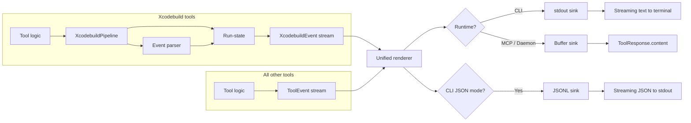

# Unified tool output pipeline

## Goal

Every tool in XcodeBuildMCP must produce its output through a single structured pipeline. No tool may construct its own formatted text. The pipeline owns all rendering, spacing, path formatting, and section structure.

This applies to:

- xcodebuild-backed tools (build, test, build & run, clean)
- query tools (list simulators, list schemes, discover projects, show build settings)
- action tools (set appearance, set location, boot simulator, install app)
- coverage tools (coverage report, file coverage)
- scaffolding tools (scaffold iOS project, scaffold macOS project)
- logging tools (start/stop log capture)
- debugging tools (attach, breakpoints, variables)
- UI automation tools (tap, swipe, type text, screenshot, snapshot UI)
- session tools (set defaults, show defaults, clear defaults)

No exceptions. If a tool produces user-visible output, it goes through the pipeline.

## Architecture principle

One renderer, two sinks.

There is exactly one rendering path that converts structured events into formatted text. The only difference between CLI and MCP is where that text goes:

- CLI sink: writes formatted text to stdout as events arrive (streaming)
- MCP sink: buffers the same formatted text and returns it in `ToolResponse.content`

There is no separate MCP renderer. There is no separate CLI renderer. There is one renderer with one output format. The sinks are dumb pipes.

The only sink-level concerns are:

- CLI interactive mode: a Clack spinner for transient status updates (the rendered durable text is identical)
- Next steps syntax: CLI renders `xcodebuildmcp workflow tool --flag "value"`, MCP renders `tool_name({ param: "value" })`. This is a single parameterised formatting function, not a separate renderer.
- Warning suppression: a session-level filter applied before rendering, not a rendering concern.

## Why this matters

Without a unified pipeline, every tool re-invents:

- spacing between sections (some add blank lines, some don't)
- file path formatting (some call `displayPath`, some don't)
- header/preflight structure (some use `formatToolPreflight`, some build strings manually)
- error formatting (some use icons, some use `[NOT COVERED]`, some use bare text)
- next steps rendering (some hardcode strings, some use the manifest)

Every new tool or refactor re-introduces the same bugs. The pipeline makes these bugs structurally impossible.

## Event model

All tools emit structured events. The renderer converts events to formatted text. Tools never produce formatted text directly.

### Generic tool events

These events cover all non-xcodebuild tools:

```ts
type ToolEvent =
  | HeaderEvent        // preflight block: operation name + params
  | SectionEvent       // titled group of content lines
  | DetailTreeEvent    // key/value pairs with tree connectors
  | StatusLineEvent    // single status message (success, error, info)
  | FileRefEvent       // a file path (always normalised)
  | TableEvent         // rows of structured data
  | SummaryEvent       // final outcome line
  | NextStepsEvent     // suggested follow-up actions
  | XcodebuildEvent;   // existing xcodebuild events (unchanged)
```

#### HeaderEvent

Replaces `formatToolPreflight`. Every tool starts with a header.

```ts
interface HeaderEvent {
  type: 'header';
  operation: string;      // e.g. 'File Coverage', 'List Simulators', 'Set Appearance'
  params: Array<{         // rendered as indented key: value lines
    label: string;
    value: string;
  }>;
  timestamp: string;
}
```

The renderer owns:

- the emoji (looked up from the operation name)
- the blank line after the heading
- the indentation of params
- the trailing blank line after the params block

Tools cannot get the spacing wrong because they never produce it.

#### SectionEvent

A titled group of content lines with an optional icon.

```ts
interface SectionEvent {
  type: 'section';
  title: string;          // e.g. 'Not Covered (7 functions, 22 lines)'
  icon?: 'red-circle' | 'yellow-circle' | 'green-circle' | 'checkmark' | 'cross' | 'info';
  lines: string[];        // indented content lines
  timestamp: string;
}
```

The renderer owns:

- the icon-to-emoji mapping
- the blank line before and after each section
- the indentation of content lines

#### DetailTreeEvent

Key/value pairs rendered with tree connectors.

```ts
interface DetailTreeEvent {
  type: 'detail-tree';
  items: Array<{ label: string; value: string }>;
  timestamp: string;
}
```

Rendered as:

```text
  ├ App Path: /path/to/app
  └ Bundle ID: com.example.app
```

The renderer owns the connector characters and indentation.

#### StatusLineEvent

A single status message.

```ts
interface StatusLineEvent {
  type: 'status-line';
  level: 'success' | 'error' | 'info' | 'warning';
  message: string;
  timestamp: string;
}
```

The renderer owns the emoji prefix based on level.

#### FileRefEvent

A file path that must be normalised.

```ts
interface FileRefEvent {
  type: 'file-ref';
  label?: string;         // e.g. 'File' — rendered as "File: <path>"
  path: string;           // raw absolute path from the tool
  timestamp: string;
}
```

The renderer always runs the path through `displayPath()` (relative if under cwd, absolute otherwise). Tools cannot bypass this.

#### TableEvent

Rows of structured data grouped under an optional heading.

```ts
interface TableEvent {
  type: 'table';
  heading?: string;       // e.g. 'iOS 18.5'
  columns: string[];      // column names for alignment
  rows: Array<Record<string, string>>;
  timestamp: string;
}
```

The renderer owns column alignment and indentation.

#### SummaryEvent (generic)

A final outcome line for non-xcodebuild tools. Different from the xcodebuild `SummaryEvent` which includes test counts and duration.

```ts
interface GenericSummaryEvent {
  type: 'generic-summary';
  level: 'success' | 'error';
  message: string;
  timestamp: string;
}
```

#### NextStepsEvent

Unchanged from the existing model. Parameterised rendering for CLI vs MCP syntax.

### Xcodebuild events

The existing `XcodebuildEvent` union type is unchanged. Xcodebuild-backed tools continue to use:

- `start` (replaces `HeaderEvent` for xcodebuild tools — the start event already contains the preflight)
- `status`, `warning`, `error`, `notice`
- `test-discovery`, `test-progress`, `test-failure`
- `summary`
- `next-steps`

The xcodebuild event parser feeds these into the same pipeline. The renderer handles both generic tool events and xcodebuild events.

## Pipeline architecture

### For xcodebuild-backed tools (existing, unchanged)

```text
tool logic
  -> startBuildPipeline(...)
  -> XcodebuildPipeline
  -> parser + run-state
  -> ordered XcodebuildEvent stream
  -> renderer -> sink (stdout or buffer)
```

This path remains as-is. The xcodebuild parser, run-state layer, and event types do not change.

### For all other tools (new)

```text
tool logic
  -> emits ToolEvent[] (or streams them)
  -> renderer -> sink (stdout or buffer)
```

Simple tools emit events synchronously and return them. The pipeline renders them and routes to the appropriate sink.

There is no parser or run-state layer for non-xcodebuild tools. They don't need one — they already have structured data. The pipeline is just: structured events -> renderer -> sink.

### Mermaid diagram



### Sink behaviour

#### CLI stdout sink

- Writes each rendered line to stdout immediately
- In interactive TTY mode: uses Clack spinner for transient status events, replaces in place
- In non-interactive mode: writes all events as durable lines
- Formatting is identical to MCP — the only difference is transient spinner behaviour

#### MCP buffer sink

- Buffers all rendered text
- Returns as `ToolResponse.content` when the tool completes
- Identical formatting to CLI non-interactive mode

#### CLI JSONL sink

- Serialises each event as one JSON line to stdout
- Does not go through the text renderer
- Only available for xcodebuild-backed tools (they have a rich event model)
- Non-xcodebuild tools do not need JSONL — their output is simple enough that text suffices

## Renderer contract

One renderer. One set of formatting rules. All tools.

```ts
interface ToolOutputRenderer {
  onEvent(event: ToolEvent | XcodebuildEvent): void;
  finalize(): string[];  // returns buffered lines (used by MCP sink)
}
```

The renderer is the single source of truth for:

- emoji selection per operation/level/icon
- spacing between sections (always one blank line)
- file path normalisation (always `displayPath()`)
- indentation depth (always 2 spaces for params, content lines)
- tree connector characters
- next steps formatting (parameterised by runtime)
- section ordering enforcement

### Formatting rules enforced by the renderer

These rules are not guidelines. They are enforced structurally because tools cannot produce formatted text.

1. **Header always has a trailing blank line.** The renderer emits: blank line, emoji + operation, blank line, indented params, blank line. Every tool. No exceptions.

2. **File paths are always normalised.** `FileRefEvent` paths always go through `displayPath()`. Xcodebuild diagnostic paths go through `formatDiagnosticFilePath()`. There is no code path where a raw absolute path reaches the output.

3. **Sections are always separated by blank lines.** The renderer adds one blank line before each section. Tools cannot omit or double this.

4. **Icons are always consistent.** The renderer maps `icon` enum values to emoji. Tools do not contain emoji characters.

5. **Next steps are always last.** The renderer enforces ordering. Nothing renders after next steps.

6. **Error messages follow the convention.** `Failed to <action>: <detail>`. The renderer does not enforce this (it's a content concern), but the pipeline API makes it easy to follow.

## How tools emit events

### Simple action tools (e.g. set appearance)

```ts
return toolResponse([
  header('Set Appearance', [
    { label: 'Simulator', value: simulatorId },
  ]),
  statusLine('success', `Appearance set to ${mode} mode`),
]);
```

### Query tools (e.g. list simulators)

```ts
return toolResponse([
  header('List Simulators'),
  ...grouped.map(([runtime, devices]) =>
    table(runtime, ['Name', 'UUID', 'State'],
      devices.map(d => ({ Name: d.name, UUID: d.udid, State: d.state }))
    )
  ),
  nextSteps([...]),
]);
```

### Coverage tools (e.g. file coverage)

```ts
return toolResponse([
  header('File Coverage', [
    { label: 'xcresult', value: xcresultPath },
    { label: 'File', value: file },
  ]),
  fileRef('File', entry.filePath),
  statusLine('info', `Coverage: ${pct}% (${covered}/${total} lines)`),
  section('Not Covered', notCoveredLines, { icon: 'red-circle',
    title: `Not Covered (${count} functions, ${missedLines} lines)` }),
  section('Partial Coverage', partialLines, { icon: 'yellow-circle',
    title: `Partial Coverage (${count} functions)` }),
  section('Full Coverage', [`${fullCount} functions — all at 100%`], { icon: 'green-circle',
    title: `Full Coverage (${fullCount} functions) — all at 100%` }),
  nextSteps([...]),
]);
```

### Xcodebuild tools

These keep the existing parser and run-state layers (`startBuildPipeline()`, `executeXcodeBuildCommand()`, `createPendingXcodebuildResponse()`), but the run-state output gets mapped to `ToolEvent` types before reaching the renderer. The xcodebuild parser remains an ingestion layer — it just feeds into the unified event model instead of having its own rendering path. Streaming and Clack progress are preserved as CLI sink concerns.

## Locked human-readable output contract

The output structure for all tools follows the same rhythm:

```text
<emoji> <Operation Name>

  <Param>: <value>
  <Param>: <value>

<body sections — varies by tool>

<summary or status line>

<execution-derived footer — if applicable>

Next steps:
1. <step>
2. <step>
```

### For xcodebuild-backed tools

The canonical examples are `build_run_macos` and `build_run_sim`. Their output contract is locked:

Successful runs:

1. front matter (header event / start event)
2. runtime state and durable diagnostics
3. summary
4. execution-derived footer (detail tree)
5. next steps

Failed runs:

1. front matter
2. runtime state and/or grouped diagnostics
3. summary

Failed runs do not render next steps.

### For non-xcodebuild tools

Successful runs:

1. header
2. body (sections, tables, file refs, status lines — tool-specific)
3. next steps (if applicable)

Failed runs:

1. header
2. error status line
3. no next steps

### Example outputs

#### Build (xcodebuild pipeline — existing)

```text
🔨 Build

  Scheme: CalculatorApp
  Workspace: example_projects/iOS_Calculator/CalculatorApp.xcworkspace
  Configuration: Debug
  Platform: iOS Simulator
  Simulator: iPhone 17

✅ Build succeeded. (⏱️ 12.3s)

Next steps:
1. Get built app path: xcodebuildmcp simulator get-app-path --scheme "CalculatorApp"
```

#### File Coverage (generic pipeline — new)

```text
📊 File Coverage

  xcresult: /tmp/TestResults.xcresult
  File: CalculatorService.swift

File: example_projects/.../CalculatorService.swift
Coverage: 83.1% (157/189 lines)

🔴 Not Covered (7 functions, 22 lines)
  L159  CalculatorService.deleteLastDigit() — 0/16 lines
  L58  implicit closure #2 in inputNumber(_:) — 0/1 lines

🟡 Partial Coverage (4 functions)
  L184  updateExpressionDisplay() — 80.0% (8/10 lines)
  L195  formatNumber(_:) — 85.7% (18/21 lines)

🟢 Full Coverage (28 functions) — all at 100%

Next steps:
1. View overall coverage: xcodebuildmcp coverage get-coverage-report --xcresult-path "/tmp/TestResults.xcresult"
```

#### List Simulators (generic pipeline — new)

```text
📱 List Simulators

iOS 18.5:
  iPhone 16 Pro    A1B2C3D4-...  Booted
  iPhone 16        E5F6G7H8-...  Shutdown
  iPad Pro 13"     I9J0K1L2-...  Shutdown

iOS 17.5:
  iPhone 15        M3N4O5P6-...  Shutdown

Next steps:
1. Boot simulator: xcodebuildmcp simulator-management boot --simulator-id "UUID"
```

#### Set Appearance (generic pipeline — new)

```text
🎨 Set Appearance

  Simulator: A1B2C3D4-E5F6-...

✅ Appearance set to dark mode
```

#### Discover Projects (generic pipeline — new)

```text
🔍 Discover Projects

  Search Path: .

Workspaces:
  example_projects/iOS_Calculator/CalculatorApp.xcworkspace

Projects:
  example_projects/iOS_Calculator/CalculatorApp.xcodeproj

Next steps:
1. List schemes: xcodebuildmcp project-discovery list-schemes --workspace-path "example_projects/iOS_Calculator/CalculatorApp.xcworkspace"
```

## Xcodebuild pipeline specifics

The existing xcodebuild pipeline architecture is preserved. This section documents it for reference.

### Execution flow

1. Tool calls `startBuildPipeline(...)` from `src/utils/xcodebuild-pipeline.ts`
2. Pipeline creates parser and run-state, emits initial `start` event
3. Raw stdout/stderr chunks feed into `createXcodebuildEventParser(...)`
4. Parser emits structured events into `createXcodebuildRunState(...)`
5. Tool-emitted events (post-build notices, errors) enter run-state through `pipeline.emitEvent(...)`
6. Run-state dedupes, orders, aggregates, forwards to the unified renderer
7. On finalize: summary + tail events + next-steps emitted in order

### Canonical pattern

```ts
const started = startBuildPipeline({
  operation: 'BUILD',
  toolName: 'build_run_<platform>',
  params: { scheme, configuration, platform, preflight: preflightText },
  message: preflightText,
});

const buildResult = await executeXcodeBuildCommand(..., started.pipeline);
if (buildResult.isError) {
  return createPendingXcodebuildResponse(started, buildResult, {
    errorFallbackPolicy: 'if-no-structured-diagnostics',
  });
}

// Post-build steps: emit notices for progress, errors for failures
emitPipelineNotice(started, 'BUILD', 'Resolving app path', 'info', {
  code: 'build-run-step',
  data: { step: 'resolve-app-path', status: 'started' },
});

// ... resolve, boot, install, launch ...

return createPendingXcodebuildResponse(
  started,
  { content: [], isError: false, nextStepParams: { ... } },
  {
    tailEvents: [{
      type: 'notice',
      timestamp: new Date().toISOString(),
      operation: 'BUILD',
      level: 'success',
      message: 'Build & Run complete',
      code: 'build-run-result',
      data: { scheme, platform, target, appPath, bundleId, launchState: 'requested' },
    }],
  },
);
```

### Pending response lifecycle

1. Tool returns `createPendingXcodebuildResponse(started, response, options)`
2. `postProcessToolResponse` in `src/runtime/tool-invoker.ts` detects the pending state
3. Resolves manifest-driven next-step templates against `nextStepParams`
4. Calls `finalizePendingXcodebuildResponse` which finalizes the pipeline
5. Finalized content becomes `ToolResponse.content`

### Post-build step notices

Post-build steps use `notice` events with `code: 'build-run-step'`:

Available step names (defined in `BuildRunStepName` in `src/types/xcodebuild-events.ts`):

- `resolve-app-path`
- `resolve-simulator`
- `boot-simulator`
- `install-app`
- `extract-bundle-id`
- `launch-app`

To add new steps: extend `BuildRunStepName` and add the label in `formatBuildRunStepLabel` in `src/utils/renderers/event-formatting.ts`.

### Error message convention

All post-build errors via `emitPipelineError` use: `Failed to <action>: <detail>`

### All errors get grouped rendering

All error events are batched and rendered as a single grouped section before the summary:

- If any error has a file location: `Compiler Errors (N):`
- Otherwise: `Errors (N):`

Each error: `  ✗ <message>` with optional `    <location>` and continuation lines.

### Error event message field

The `message` field must not include severity prefix. Correct: `"unterminated string literal"`. Wrong: `"error: unterminated string literal"`. The `rawLine` field preserves the original verbatim.

## Implementation steps

One canonical list. Work top to bottom. Nothing is considered done until checked off.

- [ ] Write snapshot test fixtures for all tools (TDD — fixtures define the target UX, code is updated to match)
- [ ] Define `ToolEvent` union type in `src/types/tool-events.ts`
- [ ] Define `toolResponse()` builder + helper functions: `header()`, `section()`, `statusLine()`, `fileRef()`, `table()`, `detailTree()`, `nextSteps()`
- [ ] Build unified renderer that handles `ToolEvent` (single renderer, produces formatted text)
- [ ] Build CLI stdout sink (streaming text + Clack spinner for transient events)
- [ ] Build MCP buffer sink (buffers same formatted text, returns in `ToolResponse.content`)
- [ ] Preserve CLI JSONL sink for xcodebuild events
- [ ] Migrate xcodebuild pipeline run-state to emit `ToolEvent` instead of `XcodebuildEvent` directly to renderers (preserve parser, run-state, streaming, Clack)
- [ ] Migrate simple action tools: `set_sim_appearance`, `set_sim_location`, `reset_sim_location`, `sim_statusbar`, `boot_sim`, `open_sim`, `stop_app_sim`, `stop_app_device`, `stop_mac_app`, `launch_app_sim`, `launch_app_device`, `launch_mac_app`, `install_app_sim`, `install_app_device`
- [ ] Migrate query tools: `list_sims`, `list_devices`, `discover_projs`, `list_schemes`, `show_build_settings`, `get_sim_app_path`, `get_device_app_path`, `get_app_bundle_id`, `get_mac_bundle_id`
- [ ] Migrate coverage tools: `get_coverage_report`, `get_file_coverage`
- [ ] Migrate scaffolding tools: `scaffold_ios_project`, `scaffold_macos_project`
- [ ] Migrate session tools: `session_set_defaults`, `session_show_defaults`, `session_clear_defaults`, `session_use_defaults_profile`
- [ ] Migrate logging tools: `start_sim_log_cap`, `stop_sim_log_cap`, `start_device_log_cap`, `stop_device_log_cap`
- [ ] Migrate debugging tools: `debug_attach_sim`, `debug_breakpoint_add`, `debug_breakpoint_remove`, `debug_continue`, `debug_detach`, `debug_lldb_command`, `debug_stack`, `debug_variables`
- [ ] Migrate UI automation tools: `snapshot_ui`, `tap`, `type_text`, `screenshot`, `button`, `gesture`, `key_press`, `key_sequence`, `long_press`, `swipe`, `touch`
- [ ] Migrate swift-package tools: `swift_package_build`, `swift_package_test`, `swift_package_clean`, `swift_package_run`, `swift_package_list`, `swift_package_stop`
- [ ] Migrate xcode-ide tools: `xcode_ide_call_tool`, `xcode_ide_list_tools`, `xcode_tools_bridge_disconnect`, `xcode_tools_bridge_status`, `xcode_tools_bridge_sync`, `sync_xcode_defaults`
- [ ] Migrate doctor tool
- [ ] Delete legacy rendering code: `mcp-renderer.ts`, `cli-text-renderer.ts`, `formatToolPreflight`, per-tool ad-hoc formatting, transitional xcodebuild helpers (`finalizeBuildPhase`, `createPostBuildError`, `appendStructuredEvents`, `createCompletionStatusEvent`, `finalizeBuildPipelineResult`)
- [ ] All snapshot tests pass
- [ ] Manual verification of CLI output for representative tools

## Success criteria

This work is successful when:

- every tool emits structured events through the pipeline
- one renderer produces all formatted output
- CLI and MCP output are identical (differing only in sink: stdout vs buffer)
- file paths are always normalised — no tool can produce a raw absolute path
- spacing between sections is always correct — no tool can get it wrong
- the only way to add a new tool's output is to emit events — there is no escape hatch
- adding a new output format (e.g. markdown, HTML) requires only a new renderer, not touching any tool code

## Design constraints

- no separate renderer per output mode (one renderer, parameterised by runtime for next-steps syntax)
- no formatted text construction inside tool logic
- no emoji characters inside tool logic (renderer owns the mapping)
- no `displayPath()` calls inside tool logic (renderer owns path normalisation)
- no spacing/indentation decisions inside tool logic (renderer owns layout)
- xcodebuild event parser and run-state layer are preserved — they work well and do not need to change
- CLI JSONL mode is preserved for xcodebuild events only
- no attempt to make non-xcodebuild tools streamable initially — they complete fast enough that buffered rendering is fine
